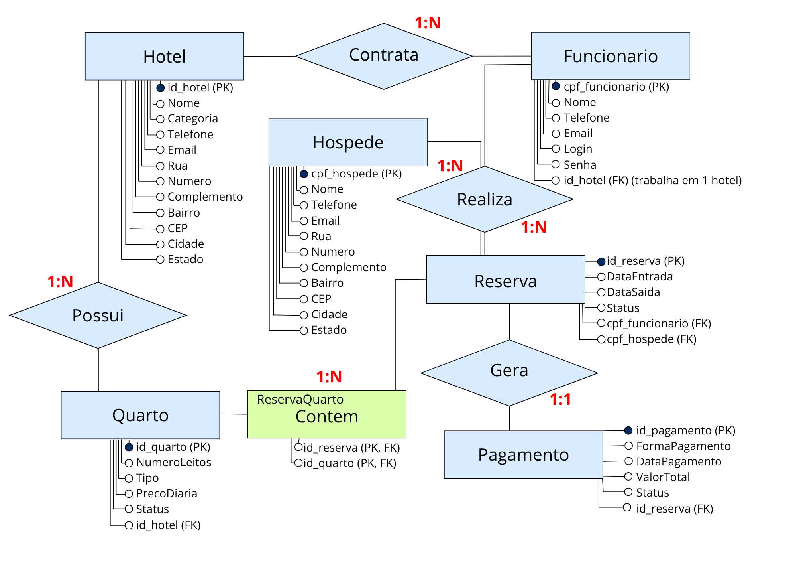

# Sistema de Hotelaria

Projeto de modelagem de banco de dados para gerenciamento de um sistema de hotelaria.

## Descrição

Este projeto foi desenvolvido para representar a estrutura de um banco de dados relacional para um sistema de hotelaria, incluindo hóspedes, reservas, quartos, funcionários e pagamentos.

## Funcionalidades

- Cadastro de hóspedes

- Controle de reservas

- Gerenciamento de quartos

- Registro de pagamentos

## Tecnologias

- MySQL

- SQL

- Modelagem de Dados (MER)

## Arquivos

- MER.pdf → Diagrama do banco

- modelo.sql → Estrutura das tabelas

- inserts.sql → Dados de teste

## Objetivo

Praticar modelagem e implementação de banco de dados com base em um cenário real.

## Demonstração do MER

